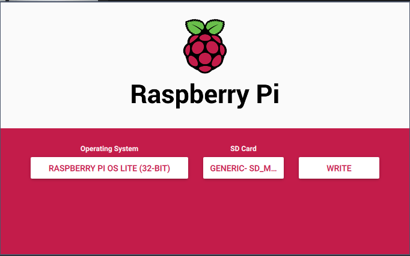

# Introduction

The purpose of this document is to provide a set of step-by-step instructions to install [Klipper](https://klipper.org) on a Formbot/Vivedino Troodon CoreXY 3D Printer (both models).

## Conventions

* Inline links will be used to reference software that can be downloaded.
* Commands issued in a terminal will be presented in `block format`

## Materials needed

* Vivedino Troodon 3D printer (300 or 400 model)
* Raspberry Pi (Zero, 3B+, 4B+)
* Micro SD Card (32GB)
* A set of Metric Hex Keys
* A computer (Windows, Mac or Linux)
* SD/MicroSD Card Reader (if not built-in to computer)
* [Raspberry Pi Imager](https://www.raspberrypi.org/software/)
* SSH Terminal - [PuTTY](https://www.chiark.greenend.org.uk/~sgtatham/putty/latest.html) (Mac & Linux users can use `ssh` command inside the terminal)
* Plain Text Editor - [Notepad++](https://notepad-plus-plus.org/downloads/) (Windows users only. Mac/Linux have text editors provided)

## Step 1 - Prepare Raspberry Pi Base OS Image

### Materials Needed

* Micro SD Card
* Computer
* SD/MicroSD Card Reader
* Raspberry Pi Imager
* Plain Text Editor

1. Download and install Raspberry Pi Imager (link provided at top of document).
2. Insert MicroSD Card into reader and connect to computer.
3. Launch Raspberry Pi Imager


4. Click on "Choose OS"
5. Select "Raspberry Pi OS (other)"


6. Select "Raspberry Pi OS Lite (32-bit)"


7. Select your SD card from the dropdown.



8. Click the "Write" button.

9. Once the Imager has completed writing OS to the MicroSD card it will automatically unmount the card. Remove the card from the reader and reinsert it. Two drives will appear. One called BOOT and one called ROOT.

10. Mount the drive called BOOT using whatever method your OS requires.

11. Open the drive with the file manager and create an empty file called `ssh`.

12. If you are going to connect via Ethernet, skip the next step.

13. To connect via Wifi, create a file called `wpa_supplicant.conf` and copy the following lines into it:

```
country=US
ctrl_interface=DIR=/var/run/wpa_supplicant GROUP=netdev
update_config=1
network={
ssid="YOURSSID"
scan_ssid=1
psk="YOURPASSWORD"
key_mgmt=WPA-PSK
}
```
Replace "YOURSSID" and "YOURPASSWORD" with the appropriate information for your wireless network.

14. Save the file making sure that the name remains `wpa_supplicant.conf`.

15. Unmount the BOOT disk and eject the Micro SD card.

16. Insert the MicroSD card into the Raspberry Pi and boot the device.
